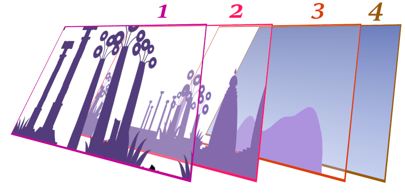

# How To: Setup Stages

The "stage" means a background environment of the scene.

## Understanding the Stage Layers

There are some layers of stages background.

(In here, "uncontrollable" means cannot change index or camera sensitivity)



1. **Topmost Layer** is rendered on top of the stage background, e.g. grass, stone.
2. **Middle Object Layer** is rendered back of the topmost layer. This might contain structure in index 1.
3. **Back Object Layer** is far-away looking objects in the stage, but still stays front of the sky layer.
4. **Background Layer** is *uncontrollable* layer that decides the sky colour, and some white smooth cloud.
5. Not in the image, but some maps might have some uncontrollable objects (especially in dungeon).

Note that some stages might have more complicated background, especially in dungeon (e.g. pillars).

## First, Decide what stages will appear, and when they will appear

If the field has more than one stage:

- If the stage will change after certain distance, declaring the start is unnecessary.
- If the stage will change in certain condition (e.g. Pondora), multiple stagae must be defined, thus it needs [startSetupStage](../startsetupstage.md).

If the field has only one stage, `startSetupStage` is not necessary.

For stage IDs, check [the reference](./reference-table.md#stage-ids).

## Second, Read the resources

Call [readArcFile](../readarcfile.md) to load the stage resources.

```c
0000008C  25100600:getPack(4:0)
00000098  25120200:setMissionTimmingScript(2:0, 4:0, 1:F0) //phase 0
    ...
    000000F8  25090900:readArcFile(2:2, "Actor/Stage/stg041.bnd")
    0000011C  25090900:readArcFile(2:2, "Actor/Stage/stg042.bnd")
    00000140  25000100:cmd_end()
```

## Third, set the stageparam

When setting [the stageparam](../setstageparam.md), **call the existing one**.

The camera sensitivity is pre-adjusted smoothly, so it is not necessary to define a new one.

```c
000000D0  25120200:setMissionTimmingScript(2:2, 4:0, 1:DD4) //phase 2
    ...
    00000DE4  25000300:cmd_call(1:E80)
        00000E80  25000300:cmd_call(1:69AC)
            000069AC  25165E00:setStageParam(1.0, 0.800000011920929, 0.699999988079071, 2:0, "stg041")
            000069D8  25000100:cmd_end()
        00000E88  25000300:cmd_call(1:69DC)
            000069DC  25165E00:setStageParam(1.0, 0.800000011920929, 0.6000000238418579, 2:0, "stg042")
            00006A08  25000100:cmd_end()
```

## Finally, add and apply the stage.

### Simple stage change by the position

For stage change after few marching, defining multiple stage will do the job.

In multiple stages, one `addStage` defines stage after 5~6 march (with pons).

So for example, if the new stage should be appeared after 10~12 march, define two same stage with `addStage` and change the stage in the third call.

```c
00000E90  25000300:cmd_call(1:10E4)
    000010E4  25165D00:addStage(2:0, 2:0, 2:0, 2:1, 2:0, "stg041")
    00001118  25165D00:addStage(2:0, 2:0, 2:0, 2:1, 2:0, "stg041")
    0000114C  25165D00:addStage(2:0, 2:0, 2:0, 2:1, 2:0, "stg041")
    00001180  25165D00:addStage(2:0, 2:0, 2:0, 2:0, 2:0, "stg042")
    000011B4  25165D00:addStage(2:0, 2:0, 2:0, 2:0, 2:0, "stg042")
    000011E8  25165D00:addStage(2:0, 2:0, 2:0, 2:0, 2:0, "stg042")
    0000121C  25000100:cmd_end()
00000E98  25165C00:endSetupStage()
00000E9C  25165F00:applyStage(2:0)
```

Do not forget to call **[applyStage](../applystage.md)** after the setting is done.

*The `applyStage` parameter is zero* in this case, because no stage group(with `startSetupStage`) is defined.

### Stage change under certain condition

For calling manual scene change, multiple stage *groups* are required.

The *group* starts with [startSetupStage](../startsetupstage.md), which has stage ID as parameter.

```c
00000CC0  25165B00:startSetupStage(2:0)
00000CCC  25165D00:addStage(2:0, 2:0, 2:0, 2:0, 2:0, "stg074")
00000D00  25165C00:endSetupStage()          //For closing *startSetupStage*
00000D04  25165B00:startSetupStage(2:1)
00000D10  25165D00:addStage(2:0, 2:0, 2:0, 2:0, 2:0, "stg076")
00000D44  25165C00:endSetupStage()          //For closing *startSetupStage*
00000D48  25165B00:startSetupStage(2:2)
00000D54  25165D00:addStage(2:0, 2:0, 2:0, 2:0, 2:0, "stg077")
00000D88  25165C00:endSetupStage()          //For closing *startSetupStage*
00000D8C  25165C00:endSetupStage()          //! DONE DEFINING ALL STAGES !
00000D90  25165F00:applyStage(2:0)          // call the stage
```

**Note that one [endSetupStage](../endsetupstage.md) in the end is not paired**.

Unlike other `endSetupStage` closing `startSetupStage`, the last one means *done defining the whole stage setup* in the mission.

#### Changing the stage

Give the stage group ID (defined with [startSetupStage](../startsetupstage.md)) to the [applyStage](../applystage.md).

```c
0002EDEC  25165F00:applyStage(2:1)
0002EDF8  25000100:cmd_end()
0002EDFC  25165F00:applyStage(2:2)
0002EE08  25000100:cmd_end()
```